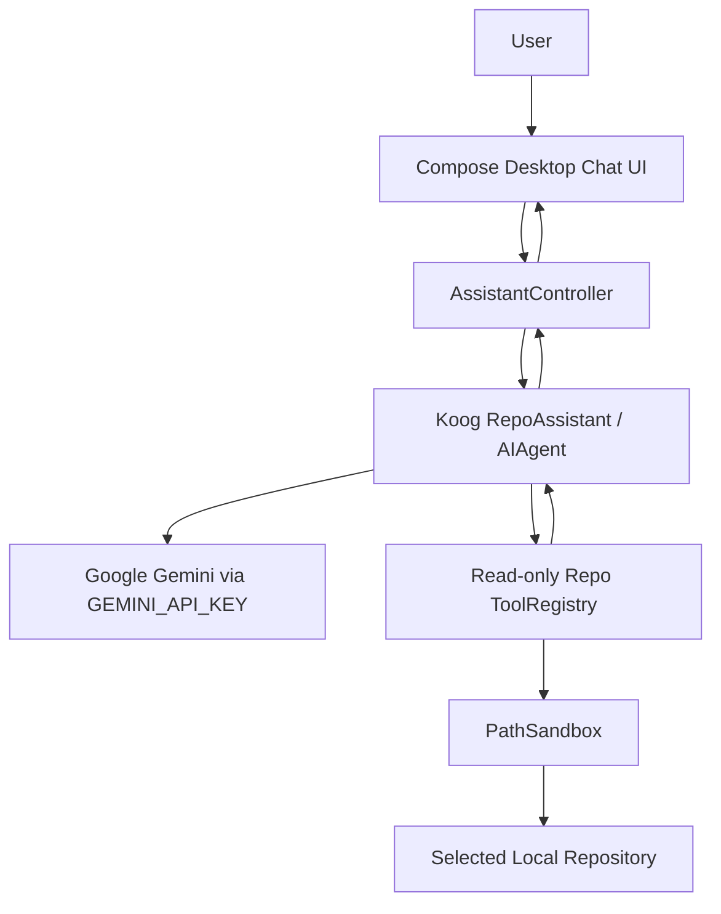

# Requirements

### Overview & Goals
Build a polished Kotlin/Compose Desktop portfolio project from the current minimal `HelloDave` scaffold: a Koog-powered **Repo Explorer Assistant** that answers questions about a local codebase using read-only repository tools and Google Gemini.

The project should demonstrate senior-level engineering skills without becoming overly large:

- Idiomatic Kotlin application structure instead of the current single-file `src/Main.kt` hello-world sample.
- Koog agent integration with custom tools.
- Gemini-backed reasoning via `GEMINI_API_KEY`.
- A minimal but professional Compose Desktop chat interface.
- Safe local repository exploration with citations to files and line ranges.
- Simple user choices in the UI so the demo feels guided and intentional.
- A simple, maintainable implementation path with focused tests and documentation that makes the repository portfolio-ready on GitHub.

### Scope
#### In Scope
- Convert the IntelliJ-only Kotlin module (`HelloDave.iml`, `src/Main.kt`) into a portable Gradle Kotlin project.
- Add a Compose Desktop UI with:
  - repository path entry or picker-style text field,
  - API key status indicator,
  - chat transcript,
  - prompt input,
  - suggested action chips such as “Summarize architecture”, “Find entry points”, and “Review risks”.
- Add a Koog `AIAgent` configured for Google Gemini.
- Add read-only local repository tools:
  - list project files with filtering,
  - search file contents,
  - read bounded file snippets,
  - summarize discovered project structure.
- Add guardrails:
  - restrict access to the selected repository root,
  - block write/delete operations,
  - skip common generated or heavy directories,
  - cap tool output sizes.
- Add professional GitHub-facing documentation so the finished project is easy to understand, run, and present:
  - polished `README.md` with purpose, features, screenshots/GIF placeholders, setup, run commands, demo script, architecture, and safety notes,
  - concise project structure explanation,
  - portfolio-focused positioning that explains the engineering decisions without overselling complexity.

#### Out of Scope
- Editing files automatically.
- Full IDE integration.
- Persistent vector database or production-grade RAG pipeline.
- Multi-provider LLM switching beyond the selected Gemini default.
- Authentication, cloud deployment, or team collaboration features.

### User Stories
- As a developer, I can select a local repository and ask questions about it so I can understand unfamiliar code quickly.
- As a portfolio reviewer, I can see custom Koog tools being used safely and transparently.
- As a senior engineer demoing the project, I can choose guided prompts that showcase architecture analysis, code navigation, and risk identification.
- As a user without a configured API key, I get a clear setup message instead of a crash.

### Functional Requirements
- The app launches as a desktop window instead of printing `Hello, Kotlin!` from the current `src/Main.kt`.
- The app reads `GEMINI_API_KEY` from the environment and reports whether it is configured.
- A user can set a repository root path before asking repo-specific questions.
- The assistant must cite concrete files when answering repository questions.
- Tool calls must be read-only and constrained to the selected repository.
- Suggested prompt chips should populate or submit useful demo questions.
- Error states should be visible in the UI, including missing API key, invalid repo path, tool failure, and LLM failure.

### Non-Functional Requirements
- Keep the implementation small enough to understand in a short demo.
- Prefer clear package boundaries over framework-heavy architecture.
- Favor the simplest working design before adding abstractions, persistence, indexing, or provider switching.
- Keep public models and services small, readable, and easy to test.
- Avoid blocking the Compose UI thread during agent/tool execution.
- Keep responses and file reads bounded to avoid huge prompts or accidental secret exposure.
- Use Gradle tasks so the project can be run consistently outside IntelliJ.
- Treat documentation quality as part of the deliverable, not an afterthought.

# Technical Design

### Current Implementation
The current project is a minimal IntelliJ Kotlin module:

- `HelloDave.iml` defines `src` as a source folder, `test` as a test source folder, and depends only on `KotlinJavaRuntime`.
- `src/Main.kt` contains a default hello-world style `main()` function that prints `Hello, Kotlin!` and loop values.
- There is no `build.gradle.kts`, `settings.gradle.kts`, package structure, application framework, UI layer, tests, or external dependency management.

Because the selected interface is Compose Desktop and the selected agent framework is Koog, the plan is to replace the scaffold with a conventional Gradle JVM application while keeping the project simple.

### Key Decisions
- **Build system:** use Gradle Kotlin DSL. This makes Koog, Compose Desktop, coroutines, and test dependencies reproducible and portfolio-friendly.
- **UI:** use Compose Desktop in a single-window application. This gives visual polish while avoiding Ktor/server or web complexity.
- **LLM provider:** use Google Gemini through Koog, configured by `GEMINI_API_KEY`.
- **Agent style:** start with a straightforward Koog `AIAgent` plus custom tools rather than a complex graph workflow. This is easier to demo and still highlights tool use.
- **Repository tools:** implement only read-only tools. This keeps the project safe and focused on codebase exploration.
- **Context strategy:** use bounded search/read snippets as “RAG-lite” instead of adding a vector store. This demonstrates agentic tool use without overbuilding.
- **State management:** use simple Compose state plus a small controller/service layer that launches suspend work via coroutines.
- **Simplicity first:** avoid persistence, embeddings, background indexing, and multi-provider abstractions in the first implementation unless they are needed for the core demo.
- **Documentation as a feature:** make `README.md` and inline architecture notes strong enough that a GitHub visitor can understand the value, run the app, and evaluate the code quickly.

### Proposed File Structure
The implementation should move from the current flat `src/Main.kt` layout to Gradle’s conventional source layout:

```text
/Users/ed/IdeaProjects/HelloDave
├── settings.gradle.kts
├── build.gradle.kts
├── README.md
├── LICENSE
├── .gitignore
├── src
│   ├── main
│   │   └── kotlin
│   │       └── com
│   │           └── hellodave
│   │               └── repoassistant
│   │                   ├── Main.kt
│   │                   ├── ui
│   │                   │   ├── App.kt
│   │                   │   ├── ChatScreen.kt
│   │                   │   └── UiModels.kt
│   │                   ├── assistant
│   │                   │   ├── RepoAssistant.kt
│   │                   │   ├── AssistantController.kt
│   │                   │   └── AssistantPrompts.kt
│   │                   └── tools
│   │                       ├── RepoToolRegistry.kt
│   │                       ├── RepoFileTools.kt
│   │                       └── PathSandbox.kt
│   └── test
│       └── kotlin
│           └── com
│               └── hellodave
│                   └── repoassistant
│                       └── tools
│                           └── PathSandboxTest.kt
```

The existing `src/Main.kt` should be replaced or migrated into `src/main/kotlin/com/hellodave/repoassistant/Main.kt`.

### Build Configuration
`build.gradle.kts` should include:

- Kotlin JVM plugin.
- Compose Desktop plugin.
- Application plugin with `mainClass` set to the new packaged `MainKt`.
- `mavenCentral()` repository.
- Koog dependency from JetBrains documentation, e.g. `ai.koog:koog-agents`.
- Coroutines dependency if not already brought transitively in the desired form.
- Kotlin test dependency for utility tests.

The README should document running with:

```bash
GEMINI_API_KEY=... ./gradlew run
```

### Component Design
#### `Main.kt`
- Starts the Compose Desktop application.
- Creates the top-level `AssistantController`.
- Renders `App()`.

#### `ui/App.kt` and `ui/ChatScreen.kt`
- Own the desktop window and visual layout.
- Display repository path, API key status, messages, loading state, and suggested prompts.
- Dispatch user input to `AssistantController`.
- Avoid direct Koog/tool logic in UI composables.

#### `assistant/AssistantController.kt`
- Bridges UI state and suspend agent execution.
- Tracks selected repository root, chat messages, and in-flight request state.
- Validates preconditions before invoking the agent:
  - API key exists,
  - repository path exists,
  - no request already running.

#### `assistant/RepoAssistant.kt`
- Creates/configures the Koog `AIAgent` with Gemini.
- Applies a system prompt that positions the assistant as a senior software repo explorer.
- Registers repository tools from `RepoToolRegistry`.
- Produces answers that include citations and “what I checked” notes.

#### `tools/RepoFileTools.kt`
- Provides read-only operations:
  - `listFiles(root, globOrSubstring)` with ignored directories,
  - `searchText(root, query)` with capped results,
  - `readFileSnippet(path, startLine, maxLines)` with max bytes/lines,
  - optional `projectTree(root, maxDepth)` for architecture overview.

#### `tools/PathSandbox.kt`
- Normalizes requested paths.
- Ensures every tool request stays under the selected repository root.
- Blocks hidden/generated directories where appropriate.
- Centralizes file size and line count limits.

### Assistant Behavior Contract
The system prompt should ask the agent to:

- Use tools before answering repository-specific questions.
- Prefer concrete citations such as `src/main/kotlin/.../File.kt:10-42`.
- Say when it cannot determine something from available files.
- Separate observations from recommendations.
- Avoid claiming it modified files.
- Ask the user for a narrower question only when the repository is too large or ambiguous.

Example guided prompts:

```text
Summarize this repository's architecture and entry points.
Find the main user-facing workflows and explain how they connect.
Identify the highest-risk areas to refactor first.
Where is dependency injection or application wiring handled?
```

### Architecture Diagram


### Risks & Mitigations
- **Koog API changes:** keep Koog usage isolated in `RepoAssistant.kt` and `RepoToolRegistry.kt` so dependency adjustments do not affect the UI.
- **Large repositories:** cap file listings, search results, snippet sizes, and prompt context.
- **Unsafe path access:** route all file operations through `PathSandbox` before reading.
- **UI freezes:** run agent calls in coroutines off the UI event path and expose loading/error state.
- **Weak demo answers from insufficient context:** provide guided prompt chips and require citations/tool use in the system prompt.

# Testing

### Validation Approach
Validation should focus on deterministic project utilities plus manual end-to-end demo flows for the Koog/Gemini interaction.

### Automated Test Targets
- `PathSandboxTest.kt`
  - accepts files under the selected repository root,
  - rejects `..` traversal outside the root,
  - rejects absolute paths outside the root,
  - handles symlink-like or normalized path edge cases where practical.
- `RepoFileTools` tests, if implemented separately from Koog tool wrappers:
  - search returns capped matches,
  - snippet reads obey line limits,
  - ignored directories such as `.git`, `build`, and `.gradle` are skipped.

### Manual Demo Scenarios
- Launch the desktop app with no `GEMINI_API_KEY`; verify a clear missing-key message appears.
- Launch with `GEMINI_API_KEY`; select a small local repository and ask “Summarize architecture”.
- Ask a targeted code navigation question and verify the answer cites file paths.
- Ask for a nonexistent symbol and verify the assistant explains what it searched.
- Try a path outside the selected repository and verify it is blocked.

### Acceptance Criteria
- `./gradlew test` passes for deterministic utilities.
- `./gradlew run` launches the Compose Desktop UI.
- The app can answer at least one repository question with file citations using Gemini.
- The app never writes to the selected repository.
- The README gives a first-time GitHub visitor enough context to understand, configure, run, and demo the project.

# Portfolio Positioning

### What This Project Showcases
This project is intentionally small but demonstrates senior-level judgment:

- **Product thinking:** guided prompt chips make the assistant easy to demo.
- **Architecture:** clear separation between UI, controller, agent, and tools.
- **AI engineering:** Koog agent with tool use, bounded context, and prompt guardrails.
- **Safety:** path sandboxing and read-only file operations.
- **Kotlin skill:** Gradle Kotlin DSL, coroutines, sealed UI models, and Compose Desktop.
- **Testing discipline:** deterministic tests cover the safety-critical filesystem utilities.
- **Documentation quality:** the GitHub page should clearly communicate setup, design, demo flow, and trade-offs.
- **Pragmatism:** RAG-lite repository exploration without prematurely adding a database or backend.

### Suggested Demo Narrative
1. Show the current app as a desktop repo assistant, not a generic chatbot.
2. Pick a local repository.
3. Click “Summarize architecture” to show guided UX.
4. Ask a follow-up like “Where is the main entry point?” to show tool-driven context gathering.
5. Highlight the code structure: `ui`, `assistant`, and `tools` packages.
6. Explain that all repository access is read-only and sandboxed.

### Optional Future Enhancements
These should not be part of the first implementation, but they are good roadmap items to mention:

- Conversation persistence.
- Export answer as Markdown.
- More advanced Koog graph workflow for multi-step audits.
- Optional local provider mode with Ollama.
- Lightweight embeddings/indexing for larger repositories.

# Delivery Steps

###   Step 1: Convert the scaffold into a Gradle Compose Desktop app
The project can be launched as a Compose Desktop application using Gradle.

- Add `settings.gradle.kts` and `build.gradle.kts` with Kotlin JVM, Compose Desktop, application, Koog, coroutine, and test dependencies.
- Move the current `src/Main.kt` hello-world entry point into `src/main/kotlin/com/hellodave/repoassistant/Main.kt`.
- Replace console output with a Compose Desktop window startup.
- Add baseline `.gitignore` and README run instructions, including `GEMINI_API_KEY=... ./gradlew run`.

###   Step 2: Build the chat UI and application state model
The desktop window provides a clean repo-assistant chat experience without agent logic embedded in composables.

- Add `ui/App.kt`, `ui/ChatScreen.kt`, and `ui/UiModels.kt`.
- Implement repository path input, API key status display, chat transcript, loading/error states, and prompt input.
- Add suggested prompt chips for common senior-engineering demos such as architecture summary, entry point discovery, and risk review.
- Route UI events through `AssistantController` instead of directly invoking Koog from the UI.

###   Step 3: Implement sandboxed read-only repository tools
The assistant has safe file-system tools that can inspect only the selected repository.

- Add `tools/PathSandbox.kt` to normalize paths and enforce repository-root containment.
- Add `tools/RepoFileTools.kt` for bounded file listing, text search, snippet reading, and optional project-tree generation.
- Skip common generated/heavy directories such as `.git`, `.gradle`, `build`, `out`, and IDE metadata where appropriate.
- Add deterministic tests for path traversal prevention, snippet limits, search caps, and ignored-directory behavior.

###   Step 4: Wire Koog and Gemini into the assistant service
User questions are answered by a Koog agent backed by Gemini and the read-only repository tools.

- Add `assistant/RepoAssistant.kt` to configure the Koog `AIAgent` with Google Gemini using `GEMINI_API_KEY`.
- Add `assistant/AssistantPrompts.kt` with a senior repo-explorer system prompt requiring tool use and file citations.
- Add `tools/RepoToolRegistry.kt` to expose `RepoFileTools` through Koog’s tool registry pattern.
- Implement `assistant/AssistantController.kt` to validate API key/repository path and run agent requests asynchronously.

###   Step 5: Polish the GitHub portfolio presence and validate end to end
The finished project is easy to run, explain, and demonstrate as a professional portfolio piece.

- Update `README.md` with project purpose, feature list, setup, run command, demo script, architecture notes, safety constraints, and screenshot/GIF placeholders.
- Add a `LICENSE` file and keep `.gitignore` appropriate for a Kotlin/Gradle desktop project.
- Document the intentionally simple design choices: no writes, no vector database, no provider switching, and bounded repository tools.
- Manually validate missing API key, invalid repository path, successful architecture summary, targeted code search, and blocked out-of-root access.
- Ensure `./gradlew test` verifies deterministic utility behavior.
- Ensure `./gradlew run` launches the UI and completes a Gemini-backed repository question with file citations.