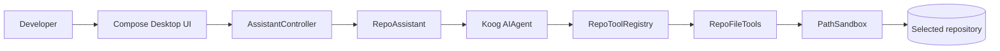

# Repo Explorer Assistant

[](https://github.com/edjchapman/HelloDave/actions/workflows/ci.yml)
[](https://github.com/edjchapman/HelloDave/actions/workflows/qodana_code_quality.yml)
[](https://kotlinlang.org/)
[](https://openjdk.org/projects/jdk/21/)
[](LICENSE)

Repo Explorer Assistant is a Kotlin and Compose Desktop portfolio project that turns the original `HelloDave` scaffold into a guided local-codebase assistant. It combines a desktop chat UI, Koog agents, configurable AI model settings, and bounded read-only repository tools so a developer can ask questions about a selected local project without giving the model unrestricted file-system access.

## What It Demonstrates

- **Kotlin + Compose Desktop:** native desktop UI, coroutine-backed assistant calls, immutable UI models, and unidirectional state flow.
- **Agentic tooling:** Koog exposes a small, explicit tool surface for listing files, searching text, reading snippets, and summarizing project structure.
- **Security-conscious local access:** path sandboxing blocks traversal outside the selected repository and skips generated or sensitive directories such as `.git`, `.gradle`, and `build`.
- **Provider flexibility:** Google Gemini, OpenAI, and Anthropic Claude clients are selected through environment configuration without changing downstream assistant code.
- **Portfolio-grade delivery:** CI, Qodana configuration, issue/PR templates, demo docs, contribution guidance, and safety-focused tests are included.

## Quickstart

```bash
./gradlew run
```

The app launches without an API key. When you submit an AI-backed question without a key, it shows a setup message instead of crashing.

For live answers, provide a supported provider key:

```bash
AI_API_KEY=your_key_here ./gradlew run
```

Then enter the absolute path to a local repository and ask a repository-specific question.

## Demo Flow

Use the app to point an AI model at this repository and ask questions that produce cited, file-grounded answers.

1. Start the app with `AI_API_KEY` set.
2. Enter the absolute path to this repository.
3. Click **Summarize this repository's architecture and entry points.**
4. Ask `What safety checks prevent the assistant from reading outside the selected repository?`
5. Point out the cited files in the response, especially `PathSandbox.kt`, `RepoFileTools.kt`, and the safety tests.

For a screen-recording script and backup demo path, see [docs/demo.md](docs/demo.md).

## Configuration

`AI_API_KEY` is preferred for all providers. If it is not set, provider-specific fallback keys are also supported.

| Provider | `AI_PROVIDER` values | Example `AI_MODEL` | Fallback key |
| --- | --- | --- | --- |
| Google Gemini | `google`, `gemini` | `gemini-2.5-pro` | `GOOGLE_API_KEY`, `GEMINI_API_KEY` |
| OpenAI | `openai` | `gpt-4.1`, `gpt-4o`, `gpt-4o-mini` | `OPENAI_API_KEY` |
| Anthropic Claude | `anthropic`, `claude` | `sonnet-4.5`, `sonnet-4`, `opus-4.1` | `ANTHROPIC_API_KEY` |

Examples:

```bash
AI_PROVIDER=google AI_MODEL=gemini-2.5-pro AI_API_KEY=... ./gradlew run
AI_PROVIDER=openai AI_MODEL=gpt-4.1 AI_API_KEY=... ./gradlew run
AI_PROVIDER=anthropic AI_MODEL=sonnet-4.5 AI_API_KEY=... ./gradlew run
```

For more detail, see [docs/configuration.md](docs/configuration.md).

## Architecture



The system keeps repository access behind one trust boundary:

- `AssistantController` validates UI input and keeps assistant calls off the UI thread.
- `RepoAssistant` creates a Koog `AIAgent` with a system prompt, configured model, bounded iterations, and repository tools.
- `RepoToolRegistry` is the only LLM-facing tool surface.
- `RepoFileTools` enforces file, search, snippet, and tree-size caps.
- `PathSandbox` normalizes paths and rejects traversal outside the selected root.

For a longer design walkthrough, see [docs/architecture.md](docs/architecture.md).

## Project Structure

```text
src/main/kotlin/com/hellodave/repoassistant
  Main.kt        Compose Desktop entry point
  assistant/     AI provider configuration, Koog orchestration, prompt rules
  tools/         Read-only repository tools and path sandbox
  ui/            Compose UI and immutable UI models

src/test/kotlin/com/hellodave/repoassistant
  assistant/     provider/configuration and controller tests
  tools/         sandbox and bounded-tool tests
```

## Development

Requirements:

- JDK 21
- Gradle wrapper from this repository
- Optional AI provider API key for live assistant answers

Common commands:

```bash
./gradlew test
./gradlew build
./gradlew packageDistributionForCurrentOS
```

Install the repository hooks:

```bash
./scripts/install-hooks.sh
```

The pre-commit hook runs `./gradlew test` before accepting a local commit.

## Quality Gates

- `./gradlew test` validates provider configuration, controller behavior, path sandboxing, snippet caps, and search caps.
- GitHub Actions runs the Gradle test/build pipeline on pull requests and pushes to `main`.
- Qodana is configured for JVM inspections through `.github/workflows/qodana_code_quality.yml` and `qodana.yaml`.
- Dependabot monitors Gradle dependencies and GitHub Actions.

## Security Model

Repo Explorer Assistant is designed for local repository inspection, not arbitrary machine access.

- Tools are read-only.
- The selected repository root is normalized before use.
- Absolute paths and `..` traversal are rejected if they escape the root.
- Generated, dependency, IDE, and VCS directories are skipped.
- File reads, search results, snippet sizes, and project tree depth are capped.
- Secrets must stay in environment variables and must not be written to the repository.

Report security-sensitive issues using the process in [SECURITY.md](SECURITY.md).

## GitHub Metadata

Recommended repository description:

> Kotlin Compose Desktop app that uses Koog and configurable AI models to explore local codebases through safe read-only tools.

Recommended topics:

`kotlin`, `compose-desktop`, `koog`, `ai-agent`, `developer-tools`, `portfolio`, `gemini`, `openai`, `anthropic`

## Roadmap

- Add a screenshot or short demo GIF after the UI stabilizes.
- Add optional agent tracing for easier portfolio walkthroughs.
- Add richer repository summaries, such as dependency and test coverage views.
- Publish signed desktop release artifacts when distribution becomes a priority.

## License

This project is licensed under the [MIT License](LICENSE).
