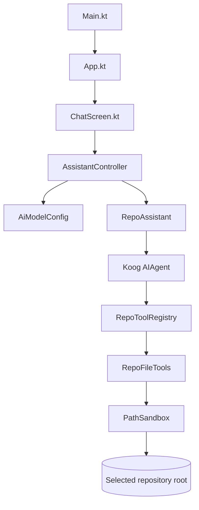

# Architecture

Repo Explorer Assistant has one main design constraint: the model can answer questions about a local repository, but it must not receive unrestricted file-system access. The implementation keeps UI state, AI orchestration, tool exposure, and path safety in separate packages so the trust boundary is easy to audit.

## UI Layer

`Main.kt` creates an `AssistantController` and launches the Compose Desktop app. `App.kt` collects the controller state and passes immutable values into `ChatScreen.kt`.

`ChatScreen.kt` renders:

- Repository root input.
- Provider/model readiness status.
- Suggested prompts.
- Chat history.
- Loading and error states.

The UI does not construct agents or touch the file system directly.

## Assistant Layer

`AssistantController` owns the single `MutableStateFlow<UiState>`. It validates user input, handles missing-key errors, and runs AI work on `Dispatchers.IO`.

`AiModelConfig` maps environment variables to a provider, model, API key, and client factory. This keeps model-specific choices out of UI and repository-tool code.

`RepoAssistant` creates a Koog `AIAgent` for each question with:

- The configured LLM client and model.
- The system prompt contract.
- The repository-specific tool registry.
- A bounded iteration count.

## Tool Layer

`RepoToolRegistry` is the LLM-facing surface. It exposes a deliberately small set of annotated Koog tools:

- List project files.
- Search file contents.
- Read a file snippet.
- Summarize project structure.

`RepoFileTools` implements the file operations and caps output through `RepoToolLimits`.

`PathSandbox` is the trust boundary. It normalizes the selected root and rejects any path that escapes it or enters ignored directories.

## Safety Invariants

- The model cannot call arbitrary shell commands.
- Repository tools are read-only.
- All file access goes through `PathSandbox`.
- Symlinks are resolved and rejected if their real path escapes the selected root.
- Generated, VCS, dependency, and IDE directories are skipped.
- Search matches, snippet lines, file bytes, listed files, and tree depth are capped.
- Tests cover provider selection, controller behavior, path traversal rejection, ignored-directory rejection, snippet caps, and search caps.
